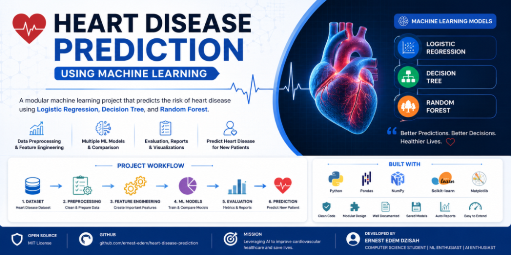
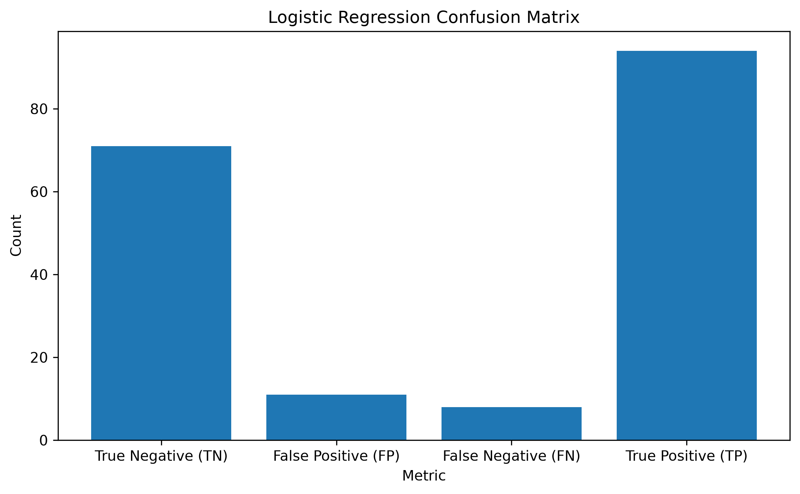
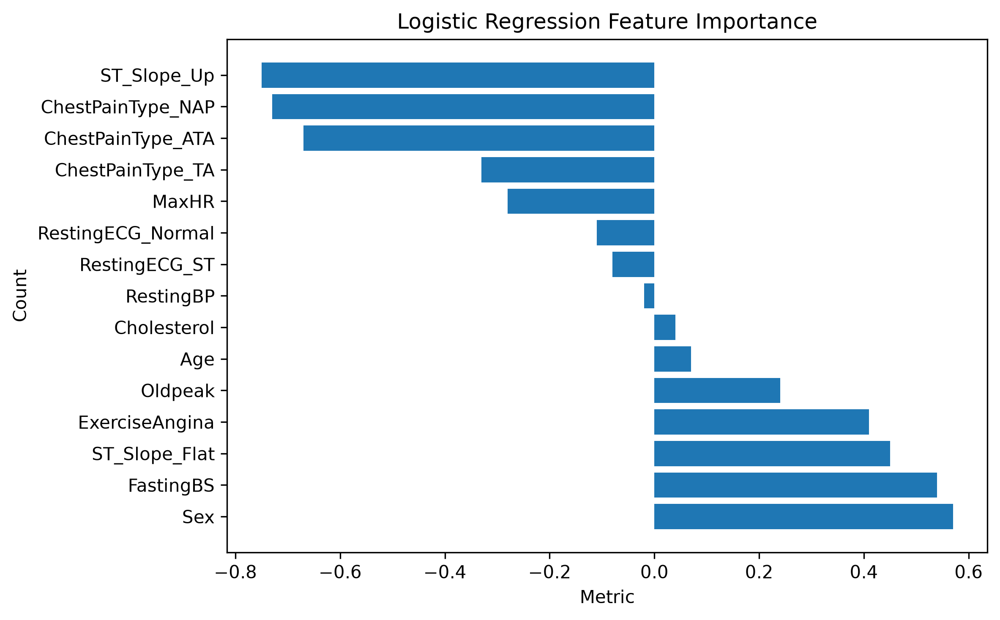

# 🫀 Heart Disease Prediction

> **A modular, production-ready Machine Learning pipeline for predicting cardiovascular disease risk using Logistic Regression, Decision Tree, and Random Forest classifiers.**

<p align="center">
    
</p>


---

# 📑 Table of Contents

* 📌 Overview
* 🎯 Project Objectives
* ⭐ Key Highlights
* 🌍 Why This Project?
* 🔄 Machine Learning Pipeline
* 🏗️ Project Architecture
* 📂 Repository Structure
* 📚 Dataset
* 📊 Model Performance
* 📈 Repository Statistics

---

# 📌 Overview

Cardiovascular disease remains one of the leading causes of death worldwide, making early diagnosis and risk assessment essential for improving patient outcomes. Machine Learning provides an effective way to assist healthcare professionals by identifying patterns in patient data that may indicate the presence of heart disease.

This project presents a complete end-to-end Machine Learning pipeline that predicts the likelihood of heart disease using patient clinical information. The pipeline covers every stage of the Machine Learning lifecycle—from data loading and preprocessing to model training, evaluation, visualization, and prediction for new patients.

The project was intentionally developed using modular software engineering principles to demonstrate clean architecture, reusable code, maintainability, and production-ready project organization.

It serves as both a practical Machine Learning application and a portfolio project demonstrating best practices in software engineering for AI systems.

---

# 🎯 Project Objectives

The primary objectives of this project are to:

* Build a complete end-to-end Machine Learning pipeline.
* Explore and understand a real-world healthcare dataset.
* Clean and preprocess clinical patient data.
* Perform feature engineering and categorical encoding.
* Train multiple supervised learning classification models.
* Compare model performance using standardized evaluation metrics.
* Generate automated reports and visualizations.
* Predict heart disease risk for new patients.
* Save trained models for future inference.
* Demonstrate production-ready Machine Learning project architecture.
* Apply software engineering best practices to Machine Learning development.

---

# ⭐ Key Highlights

This project includes:

* ✅ End-to-end Machine Learning workflow
* ✅ Production-ready modular architecture
* ✅ Three supervised learning algorithms
* ✅ Automated preprocessing pipeline
* ✅ Feature engineering
* ✅ Logistic Regression implementation
* ✅ Decision Tree implementation
* ✅ Random Forest implementation
* ✅ Model evaluation and comparison
* ✅ Feature importance analysis
* ✅ Automated report generation
* ✅ Automated chart generation
* ✅ Model persistence using Joblib
* ✅ New patient prediction
* ✅ Centralized project configuration
* ✅ Easily extendable to FastAPI, Docker, Streamlit, or cloud deployment

---

# 🌍 Why This Project?

Artificial Intelligence is increasingly transforming healthcare by enabling faster, more consistent, and data-driven decision making.

Heart disease prediction is a classic binary classification problem that provides an excellent opportunity to demonstrate the complete Machine Learning workflow while addressing a meaningful real-world challenge.

Rather than focusing solely on model accuracy, this repository emphasizes:

* Software engineering best practices
* Clean and modular architecture
* Reproducibility
* Maintainability
* Scalability
* Reusability
* Production readiness

The architecture allows new models, preprocessing techniques, and deployment strategies to be added with minimal changes to the existing codebase.

This repository was created as part of my Machine Learning portfolio to showcase practical AI engineering skills beyond notebook-based experimentation.

---

# 🔄 Machine Learning Pipeline

The project follows a structured Machine Learning workflow:

```text
Raw Dataset
      │
      ▼
Load Dataset
      │
      ▼
Explore Dataset
      │
      ▼
Data Preprocessing
      │
      ▼
Feature Engineering
      │
      ▼
Train-Test Split
      │
      ▼
Feature Scaling
      │
      ▼
Train ML Models
      │
      ▼
Generate Predictions
      │
      ▼
Evaluate Performance
      │
      ▼
Feature Importance
      │
      ▼
Model Comparison
      │
      ▼
Generate Reports
      │
      ▼
Generate Charts
      │
      ▼
Save Trained Models
      │
      ▼
Predict New Patient
```

---

# 🏗️ Project Architecture

Each module has a single responsibility, making the application easier to maintain, test, and extend.

```text
main.py
    │
    ▼
loader.py
    │
    ▼
preprocessor.py
    │
    ▼
feature_engineering.py
    │
    ├────────► StandardScaler
    │
    ▼
train_model.py
    │
    ▼
predictions.py
    │
    ▼
model_evaluation.py
    │
    ├────────► feature_importance.py
    │
    ├────────► model_comparison.py
    │
    ▼
visualization.py
    │
    ▼
generate_reports.py
    │
    ▼
save_models.py
    │
    ▼
predict_patient.py
```

### Module Responsibilities

| Module                     | Responsibility                                            |
| -------------------------- | --------------------------------------------------------- |
| **main.py**                | Controls the complete Machine Learning workflow           |
| **loader.py**              | Loads the dataset                                         |
| **preprocessor.py**        | Cleans, encodes, and preprocesses data                    |
| **feature_engineering.py** | Performs feature selection, train-test split, and scaling |
| **train_model.py**         | Trains all Machine Learning models                        |
| **predictions.py**         | Generates predictions and probability scores              |
| **model_evaluation.py**    | Evaluates model performance                               |
| **feature_importance.py**  | Computes feature importance for trained models            |
| **model_comparison.py**    | Compares all trained models                               |
| **visualization.py**       | Generates charts and visualizations                       |
| **generate_reports.py**    | Saves reports, charts, and text outputs                   |
| **save_models.py**         | Saves and loads trained models                            |
| **predict_patient.py**     | Predicts heart disease risk for new patient data          |
| **sample_data.py**         | Creates sample patient records for testing                |
| **config.py**              | Stores configurable project constants                     |

---

# 📂 Repository Structure

```text
heart_disease_prediction/
│
├── assets/
│   ├── github_banner.png
│   ├── ml_pipeline.png
│   ├── architecture.png
│   ├── age_distribution.png
│   ├── cholesterol_distribution.png
│   ├── heart_disease_distribution.png
│   ├── lg_confusion_matrix.png
│   ├── decision_tree_confusion_matrix.png
│   ├── random_forest_confusion_matrix.png
│   └── rf_feature_importance.png
│
├── charts/
│
├── dataset/
│
├── models/
│
├── reports/
│
├── src/
│   ├── loader.py
│   ├── preprocessor.py
│   ├── feature_engineering.py
│   ├── train_model.py
│   ├── predictions.py
│   ├── model_evaluation.py
│   ├── feature_importance.py
│   ├── model_comparison.py
│   ├── visualization.py
│   ├── predict_patient.py
│   ├── sample_data.py
│   ├── save_models.py
│   ├── generate_reports.py
│   ├── config.py
│   └── main.py
│
├── requirements.txt
├── README.md
├── LICENSE
└── .gitignore
```

---

# 📚 Dataset

This project uses the **Heart Failure Prediction Dataset**, a publicly available healthcare dataset commonly used for binary classification tasks.

The dataset contains demographic, physiological, and cardiovascular measurements collected from **918 patients**.

## Dataset Features

| Feature        | Description                      |
| -------------- | -------------------------------- |
| Age            | Patient age                      |
| Sex            | Biological sex                   |
| ChestPainType  | Chest pain category              |
| RestingBP      | Resting blood pressure           |
| Cholesterol    | Serum cholesterol                |
| FastingBS      | Fasting blood sugar indicator    |
| RestingECG     | Resting electrocardiogram result |
| MaxHR          | Maximum heart rate               |
| ExerciseAngina | Exercise-induced angina          |
| Oldpeak        | ST depression                    |
| ST_Slope       | Peak exercise ST slope           |

### Target Variable

| Value | Meaning          |
| ----: | ---------------- |
|     0 | No Heart Disease |
|     1 | Heart Disease    |

---

# 📊 Model Performance

All three Machine Learning models were evaluated using the same train-test split to ensure fair comparison.

| Model               | Accuracy | Precision |  Recall | F1 Score |
| ------------------- | -------: | --------: | ------: | -------: |
| Logistic Regression |  **90%** |   **90%** | **92%** |  **91%** |
| Decision Tree       |      74% |       76% |     77% |      77% |
| Random Forest       |      85% |       86% |     87% |      87% |

## 🏆 Selected Model

After comprehensive evaluation, **Logistic Regression** achieved the best overall performance.

Reasons for selecting Logistic Regression:

* Highest Accuracy
* Highest Recall
* Best F1 Score
* Strong interpretability
* Suitable for healthcare prediction systems
* Lower risk of overfitting on this dataset

Its high recall makes it particularly valuable in medical prediction systems where minimizing false negatives is essential.

---

# 📈 Repository Statistics

| Metric                  |         Value |
| ----------------------- | ------------: |
| Dataset Size            |  918 Patients |
| Features                |            15 |
| Target Classes          |             2 |
| Machine Learning Models |             3 |
| Python Modules          |           13+ |
| Reports Generated       |           10+ |
| Charts Generated        |            6+ |
| Saved Models            |             4 |
| Prediction Pipeline     |    End-to-End |
| Architecture            |       Modular |
| Deployment Ready        |         ✅ Yes |
| Documentation           | Comprehensive |
| License                 |           MIT |

---

# 🛠️ Technologies Used

This project was built using industry-standard tools and libraries commonly used in Machine Learning and Software Engineering.

| Technology   | Purpose                                    |
| ------------ | ------------------------------------------ |
| Python 3.10+ | Core programming language                  |
| Pandas       | Data loading and manipulation              |
| NumPy        | Numerical computing                        |
| scikit-learn | Machine Learning algorithms and evaluation |
| Matplotlib   | Data visualization                         |
| Joblib       | Model serialization and persistence        |
| Git          | Version control                            |
| GitHub       | Source code hosting and collaboration      |

---

# 🧠 Skills Demonstrated

This project demonstrates practical experience in:

* Machine Learning
* Data Cleaning
* Data Preprocessing
* Feature Engineering
* Exploratory Data Analysis (EDA)
* Feature Scaling
* Supervised Learning
* Binary Classification
* Model Evaluation
* Feature Importance Analysis
* Data Visualization
* Software Engineering
* Modular Programming
* Project Documentation
* Version Control with Git
* Model Serialization
* Reproducible Machine Learning Pipelines

---

# 🔧 Prerequisites

Before running this project, ensure you have the following installed:

* Python 3.10 or later
* Git
* pip (Python package manager)

Verify your installation:

```bash
python --version
pip --version
git --version
```

---

# ⚙️ Installation

### 1. Clone the Repository

```bash
git clone https://github.com/ernest-edem/heart_disease_prediction.git
```

### 2. Navigate into the Project

```bash
cd heart_disease_prediction
```

### 3. Create a Virtual Environment

**Windows**

```bash
python -m venv .venv
```

**Linux / macOS**

```bash
python3 -m venv .venv
```

---

### 4. Activate the Virtual Environment

**Windows**

```bash
.venv\Scripts\activate
```

**Linux / macOS**

```bash
source .venv/bin/activate
```

---

### 5. Install Dependencies

```bash
pip install -r requirements.txt
```

---

# 🔩 Configuration

Most project settings are centralized in `config.py`.

Example configuration:

| Constant      | Description                    |
| ------------- | ------------------------------ |
| DATASET_PATH  | Dataset location               |
| REPORT_FOLDER | Report output folder           |
| MODEL_FOLDER  | Saved models folder            |
| CHART_FOLDER  | Charts output folder           |
| RANDOM_STATE  | Random seed                    |
| TEST_SIZE     | Train/Test split ratio         |
| N_ESTIMATORS  | Random Forest trees            |
| MAX_ITER      | Logistic Regression iterations |

Changing these values allows the project to be adapted without modifying the core pipeline.

---

# ▶️ Running the Project

Execute the entire Machine Learning pipeline using:

```bash
python main.py
```

The pipeline automatically performs:

1. Dataset loading
2. Dataset inspection
3. Data preprocessing
4. Feature engineering
5. Train/Test split
6. Feature scaling
7. Model training
8. Model evaluation
9. Feature importance generation
10. Model comparison
11. Chart generation
12. Report generation
13. Model serialization
14. New patient prediction

---

# 📋 Example Prediction

## Sample Patient

| Feature             | Value |
| ------------------- | ----: |
| Age                 |    54 |
| Sex                 |  Male |
| Resting BP          |   145 |
| Cholesterol         |   245 |
| Fasting Blood Sugar |     1 |
| Max Heart Rate      |   122 |
| Exercise Angina     |   Yes |
| Oldpeak             |   2.4 |

### Prediction Results

| Model               | Prediction    | Probability |
| ------------------- | ------------- | ----------: |
| Logistic Regression | Heart Disease |       91.6% |
| Decision Tree       | Heart Disease |       90.2% |
| Random Forest       | Heart Disease |       92.7% |

---

# 📷 Project Screenshots

## Model Evaluation

<p align="center">


</p>

---

# 📊 Generated Reports

Running the project automatically generates:

* Dataset Summary
* Encoded Dataset
* Logistic Regression Prediction Report
* Decision Tree Prediction Report
* Random Forest Prediction Report
* Feature Importance Reports
* Model Comparison Report
* Classification Reports
* Confusion Matrix Reports
* New Patient Prediction Report

All reports are stored inside the `reports/` directory.

---

# 💾 Saved Models

The following trained models are automatically saved:

* Logistic Regression
* Decision Tree
* Random Forest
* StandardScaler

These artifacts can be reloaded without retraining, enabling fast inference and deployment.

---

# 🧩 Design Principles

The project follows established software engineering principles.

| Principle              | Implementation                                                      |
| ---------------------- | ------------------------------------------------------------------- |
| Modular Design         | Independent modules with single responsibilities                    |
| Separation of Concerns | Training, preprocessing, evaluation, and visualization are isolated |
| Reusability            | Components can be reused across projects                            |
| Maintainability        | Clean, readable, and well-organized code                            |
| Scalability            | Easy to add new models and preprocessing techniques                 |
| Reproducibility        | Centralized configuration and deterministic random seed             |

---

# 🗺️ Project Roadmap

## ✅ Completed

* Dataset preprocessing
* Feature engineering
* Logistic Regression
* Decision Tree
* Random Forest
* Model evaluation
* Feature importance
* Automated reports
* Automated charts
* Patient prediction
* Model persistence

## 🚧 Planned

* Hyperparameter tuning
* Cross-validation
* XGBoost
* LightGBM
* CatBoost
* SHAP Explainability
* FastAPI deployment
* Streamlit dashboard
* Docker
* GitHub Actions CI/CD
* Cloud deployment (AWS / Azure / GCP)

---

# 🚀 Future Improvements

Potential future enhancements include:

* Automated hyperparameter optimization
* Advanced feature engineering
* Explainable AI (SHAP/LIME)
* REST API using FastAPI
* Interactive dashboard using Streamlit
* Docker containerization
* MLOps workflow
* Continuous Integration / Continuous Deployment
* Cloud hosting
* Real-time prediction API

---

# 📖 What I Learned

Building this project strengthened my understanding of:

* Machine Learning workflows
* Data preprocessing techniques
* Feature engineering
* Binary classification
* Model evaluation
* Feature importance
* Modular Python development
* Production-ready project organization
* Documentation best practices
* Version control with Git
* Building maintainable ML systems

---

# 🚧 Challenges and Solutions

| Challenge                      | Solution                                         |
| ------------------------------ | ------------------------------------------------ |
| Handling categorical variables | Applied binary and one-hot encoding              |
| Different scaling requirements | Scaled only Logistic Regression features         |
| Code duplication               | Refactored into reusable modules                 |
| Model persistence              | Implemented Joblib serialization                 |
| Project organization           | Adopted a modular architecture                   |
| Maintainability                | Centralized configuration and reusable functions |

---

# 🤝 Contributing

Contributions are welcome.

1. Fork the repository.
2. Create a feature branch.

```bash
git checkout -b feature/new-feature
```

3. Commit your changes.

```bash
git commit -m "feat: add new feature"
```

4. Push your branch.

```bash
git push origin feature/new-feature
```

5. Open a Pull Request.

---

# 📄 License

This project is licensed under the **MIT License**.

See the `LICENSE` file for more information.

---

# 🙏 Acknowledgments

Special thanks to:

* Kaggle for the Heart Failure Prediction Dataset
* The scikit-learn development team
* The Pandas community
* The NumPy community
* The Matplotlib developers
* The Python open-source community

---

# 👨‍💻 Author

## Ernest Edem Dzisah

**Computer Science and Engineering Student**

Aspiring **Software Engineer**, **Machine Learning Engineer**, and **AI Engineer** passionate about building intelligent systems that solve real-world problems.

### Connect with Me

**GitHub**

https://github.com/ernest-edem

**LinkedIn**

https://www.linkedin.com/in/ernest-edem-dzisah

**Email**

[ernestedem.d@gmail.com](mailto:ernestedem.d@gmail.com)

---

# ⭐ Support

If you found this repository useful:

* ⭐ Star the repository
* 🍴 Fork the project
* 💡 Open an issue with suggestions
* 🤝 Connect with me on LinkedIn

Your support is greatly appreciated.

---

> **Portfolio Project:** This repository was developed as part of my Machine Learning engineering portfolio to demonstrate practical skills in data preprocessing, feature engineering, supervised learning, software engineering, model evaluation, reproducible workflows, and production-ready project organization.

