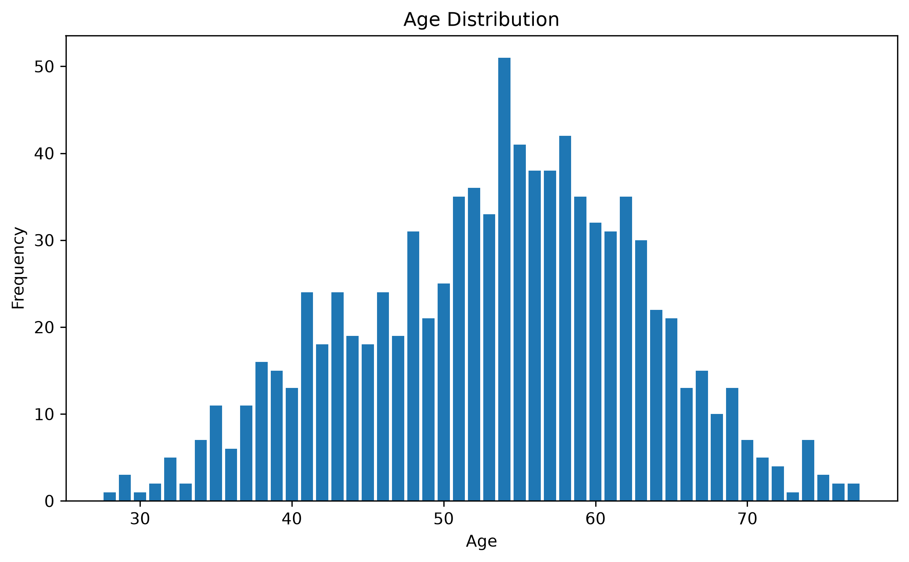
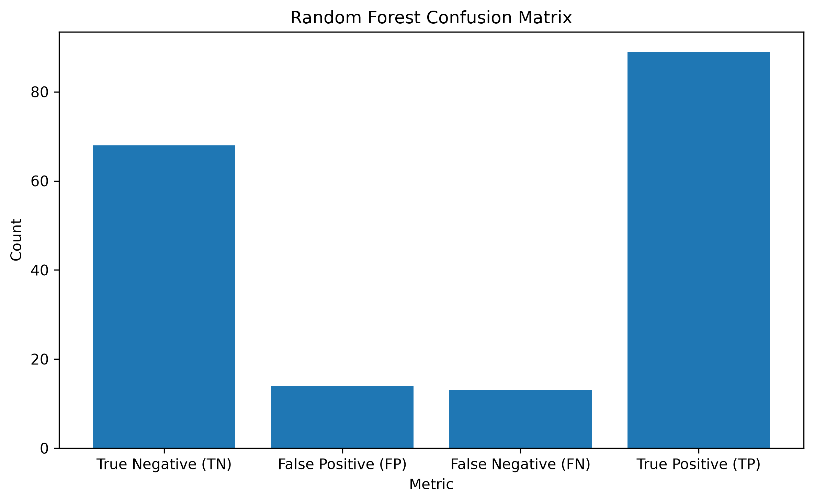
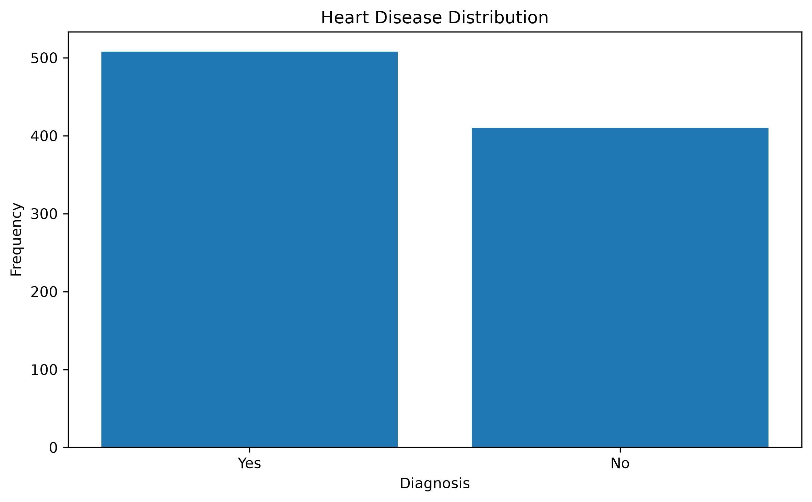
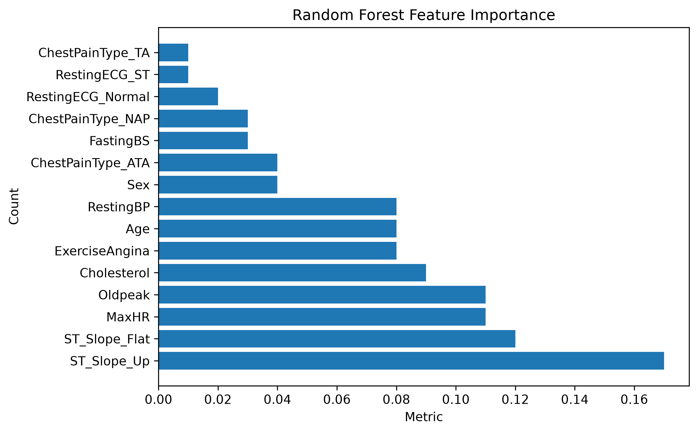

# 🫀 Heart Disease Prediction

> A modular, production-ready machine learning pipeline for predicting cardiovascular risk using Logistic Regression, Decision Tree, and Random Forest classifiers.


---

## 📑 Table of Contents

- [Overview](#-overview)
- [Features](#-features)
- [Project Architecture](#️-project-architecture)
- [Dataset](#-dataset)
- [Model Performance](#-model-performance)
- [Technologies Used](#-technologies-used)
- [Prerequisites](#-prerequisites)
- [Installation](#️-installation)
- [Configuration](#-configuration)
- [Running the Project](#️-running-the-project)
- [Example Prediction](#-example-prediction)
- [Project Screenshots](#️-project-screenshots)
- [Design Principles](#-design-principles)
- [Future Improvements](#-future-improvements)
- [What I Learned](#-what-i-learned)
- [Contributing](#-contributing)
- [License](#-license)
- [Acknowledgments](#-acknowledgments)
- [Author](#-author)

---

## 📌 Overview

This project implements an end-to-end supervised machine learning pipeline that predicts the likelihood of heart disease in patients based on clinical and demographic features. The pipeline covers the complete ML lifecycle — from data ingestion and preprocessing through model training, evaluation, and inference — and is structured following software engineering best practices for maintainability and scalability.

---

## ✨ Features

- Automated end-to-end ML pipeline from raw data to prediction
- Multi-model training and comparison (Logistic Regression, Decision Tree, Random Forest)
- Feature importance analysis per model
- Automated report and chart generation
- New patient inference with probability scores
- Centralized configuration via `config.py`
- Trained model persistence using Joblib

---

## 🏗️ Project Architecture

The project follows a modular architecture where each module has a single responsibility, making the codebase easy to maintain, test, and extend.

### Pipeline Flow

```
main.py
    │
    ▼
loader.py
    │
    ▼
preprocessor.py
    │
    ▼
feature_engineering.py
    │
    ├──────────────► StandardScaler
    │
    ▼
train_model.py
    │
    ▼
predictions.py
    │
    ▼
model_evaluation.py
    │
    ├──────────────► feature_importance.py
    │
    ├──────────────► model_comparison.py
    │
    ▼
visualization.py
    │
    ▼
generate_reports.py
    │
    ▼
save_models.py
    │
    ▼
predict_patient.py
```

### End-to-End Workflow

```
Load Dataset → Explore Dataset → Preprocess Data → Feature Engineering
      │
      ▼
Split Dataset → Scale Features → Train Models → Generate Predictions
      │
      ▼
Evaluate Models → Feature Importance → Compare Models
      │
      ▼
Generate Reports & Charts → Save Models → Predict New Patient
```

### Module Responsibilities

| Module | Responsibility |
|---|---|
| `main.py` | Controls the complete ML workflow from data loading to prediction |
| `loader.py` | Loads the dataset into a Pandas DataFrame |
| `preprocessor.py` | Cleans data, encodes categorical variables, generates statistics, and saves the processed dataset |
| `feature_engineering.py` | Selects features, splits the dataset, and scales numerical features for Logistic Regression |
| `train_model.py` | Trains Logistic Regression, Decision Tree, and Random Forest models |
| `predictions.py` | Generates predictions and probability scores for the test dataset |
| `model_evaluation.py` | Calculates Accuracy, Precision, Recall, F1 Score, Confusion Matrix, and Classification Report |
| `feature_importance.py` | Calculates feature importance for all trained models |
| `model_comparison.py` | Builds a comparison report summarising performance across all models |
| `predict_patient.py` | Predicts heart disease risk for new patient records using trained models |
| `sample_data.py` | Generates sample patient records for testing inference |
| `visualization.py` | Creates charts such as distributions and confusion matrices |
| `generate_reports.py` | Saves reports, text files, and visualization images |
| `save_models.py` | Saves and reloads trained models using Joblib |
| `config.py` | Stores configurable project constants such as dataset paths and training parameters |

---

## 📚 Dataset

This project uses a publicly available heart disease dataset containing demographic and cardiovascular health information.

**Source:** Kaggle Machine Learning Repository

### Input Features

| Feature | Description |
|---|---|
| Age | Patient age in years |
| Sex | Biological sex (Male / Female) |
| Chest Pain Type | Type of chest pain experienced |
| Resting Blood Pressure | Resting BP in mm Hg |
| Cholesterol | Serum cholesterol in mg/dL |
| Fasting Blood Sugar | Fasting blood sugar > 120 mg/dL (1 = True, 0 = False) |
| Resting ECG | Resting electrocardiographic results |
| Maximum Heart Rate | Maximum heart rate achieved |
| Exercise-Induced Angina | Whether exercise induces angina (Yes / No) |
| Oldpeak | ST depression induced by exercise relative to rest |
| ST Slope | Slope of the peak exercise ST segment |

### Target Variable

| Value | Label |
|---|---|
| `0` | No Heart Disease |
| `1` | Heart Disease |

---

## 📊 Model Performance

All models are evaluated against the same held-out test dataset for a fair comparison.

| Model | Accuracy | Precision | Recall | F1 Score |
|---|---:|---:|---:|---:|
| Logistic Regression | 0.90 | 0.90 | 0.92 | 0.91 |
| Decision Tree | 0.74 | 0.76 | 0.77 | 0.77 |
| Random Forest | 0.85 | 0.86 | 0.87 | 0.87 |

### 🏆 Best Performing Model: Logistic Regression

The evaluation results demonstrate that **Logistic Regression achieved the best overall performance**, outperforming the other models across all major evaluation metrics. With an accuracy of **90%** and an F1 score of **91%**, the model provided the strongest balance between correctly identifying positive cases and minimizing classification errors.

The model achieved a **92% recall score**, which is particularly significant in healthcare-related prediction systems where identifying potential disease cases is a priority. A high recall value reduces the likelihood of false negatives, ensuring that fewer high-risk patients are incorrectly classified as healthy.

**Random Forest** achieved competitive performance with an F1 score of **87%**, demonstrating good generalization capability and robustness through ensemble learning. However, its performance remained slightly below Logistic Regression for this dataset.

**Decision Tree** produced the lowest performance, with an accuracy of **74%** and an F1 score of **77%**, suggesting possible limitations in capturing complex patterns and a higher risk of overfitting.

### Final Model Selection

Based on comprehensive evaluation, **Logistic Regression was selected as the final prediction model** due to its superior classification performance, interpretability, and suitability for healthcare risk prediction scenarios.

The selected model provides:
- ✅ High predictive accuracy (90%)
- ✅ Strong disease detection capability (92% recall)
- ✅ Balanced classification performance (91% F1 score)
- ✅ Improved interpretability for explainable AI applications

This evaluation confirms that the developed machine learning pipeline can effectively support automated disease risk assessment while maintaining transparency and reliability.


---

## 📦 Technologies Used

| Technology | Purpose |
|---|---|
| Python 3.8+ | Core programming language |
| Pandas | Data loading and manipulation |
| NumPy | Numerical computation |
| scikit-learn | Model training, evaluation, and scaling |
| Matplotlib | Chart and visualization generation |
| Joblib | Model serialization and persistence |

---

## 🔧 Prerequisites

Before installation, ensure you have the following installed on your system:

- **Python 3.8 or higher** — [Download Python](https://www.python.org/downloads/)
- **pip** — Python package manager (included with Python 3.4+)
- **Git** — [Download Git](https://git-scm.com/downloads)

Verify your Python installation:

```bash
python --version
# or
python3 --version
```

---

## ⚙️ Installation

### 1. Clone the Repository

```bash
git clone https://github.com/ernest-edem/heart_disease_prediction.git
```

### 2. Navigate to the Project Directory

```bash
cd heart_disease_prediction
```

### 3. Create a Virtual Environment

**Windows:**
```bash
python -m venv .venv
```

**Linux / macOS:**
```bash
python3 -m venv .venv
```

### 4. Activate the Virtual Environment

**Windows:**
```bash
.venv\Scripts\activate
```

**Linux / macOS:**
```bash
source .venv/bin/activate
```

### 5. Install Required Packages

```bash
pip install -r requirements.txt
```

---

## 🔩 Configuration

All configurable constants are centralised in `config.py`. Before running the project, review and adjust the following settings if needed:

| Constant | Description | Default |
|---|---|---|
| `DATASET_DIR` | Path to the raw CSV dataset | `heart_disease.csv` |
| `RANDOM_SEED` | Seed for reproducibility | `42` |
| `TEST_SIZE` | Proportion of data for testing | `0.2` |
| `REPORT_DIR` | Directory for saved reports and charts | `reports/` |
| `MODELS_DIR` | Directory for saved model files | `models/` |

---

## ▶️ Running the Project

Run the full pipeline with a single command:

```bash
python main.py
```

The pipeline will automatically:

1. Load and inspect the dataset
2. Preprocess and encode categorical features
3. Perform feature engineering and scaling
4. Split data into training and testing sets
5. Train all three machine learning models
6. Evaluate and compare model performance
7. Generate reports and charts
8. Save trained models to disk
9. Predict heart disease risk for a sample new patient

---

## 📋 Example Prediction

### Input Patient

| Feature | Value |
|---|---:|
| Age | 54 |
| Sex | Male |
| Resting Blood Pressure | 145 mmHg |
| Cholesterol | 245 mg/dL |
| Fasting Blood Sugar | 1 (True) |
| Maximum Heart Rate | 122 bpm |
| Exercise-Induced Angina | Yes |
| Oldpeak | 2.4 |

### Output

```
Model:       Random Forest Classifier
Prediction:  Heart Disease
Probability: 92.7%
```

---

## 📷 Project Screenshots







---

## 🧩 Design Principles

This project was developed following established software engineering best practices:

| Principle | Implementation |
|---|---|
| **Modular Architecture** | Each module has a single, well-defined responsibility |
| **Separation of Concerns** | Preprocessing, training, evaluation, and visualization are fully isolated |
| **Reusable Functions** | Each component can be independently imported into other projects |
| **Reproducibility** | Random seed and split ratios are centralised in `config.py` |
| **Maintainability** | Adding a new model or preprocessing step requires minimal changes |
| **Scalability** | The structure supports extension into a REST API, web app, or production ML pipeline |

---

## 🚀 Future Improvements

Planned enhancements include:

- [ ] Hyperparameter tuning with `GridSearchCV`
- [ ] K-Fold cross-validation
- [ ] XGBoost, LightGBM, and CatBoost implementations
- [ ] SHAP explainability for model interpretability
- [ ] Advanced feature selection techniques
- [ ] FastAPI REST API deployment
- [ ] Streamlit interactive dashboard
- [ ] Docker containerization
- [ ] Unit testing with `pytest`
- [ ] GitHub Actions CI/CD pipeline
- [ ] Cloud deployment (AWS, Azure, or Google Cloud)

---

## 📖 What I Learned

Developing this project strengthened my understanding of:

- Structuring machine learning projects using modular architecture
- Data preprocessing and categorical feature encoding techniques
- Training and comparing multiple classification algorithms
- Evaluating models using standard classification metrics
- Feature importance analysis across different model types
- Persisting and reloading trained models for inference
- Organising reports and visualizations for reproducibility
- Writing maintainable, reusable, and production-oriented Python code
- Software engineering for ML projects
- Managing machine learning artifacts
- Organizing production-ready project structures

---

# 🚧 Challenges and Solutions

| Challenge | Solution |
|-----------|----------|
| Encoding categorical variables | Used binary and one-hot encoding |
| Different scaling requirements | Applied StandardScaler only to Logistic Regression |
| Code duplication | Refactored into reusable modules |
| Model persistence | Used Joblib to save and reload trained models |
| Maintainability | Adopted a modular architecture with single-responsibility modules |

---

## 🤝 Contributing

Contributions, suggestions, and improvements are welcome.

1. Fork the repository
2. Create a new feature branch: `git checkout -b feature/your-feature-name`
3. Commit your changes: `git commit -m "feat: add your feature"`
4. Push to the branch: `git push origin feature/your-feature-name`
5. Open a Pull Request

Please ensure your code follows the existing modular structure and includes appropriate comments.

---

## 📄 License

This project is licensed under the **MIT License**. See the [`LICENSE`](LICENSE) file for full details.

---

## 🙏 Acknowledgments

- [Kaggle - Heart Failure Prediction Dataset](https://www.kaggle.com/datasets/fedesoriano/heart-failure-prediction?utm_source=chatgpt.com) — for the heart disease dataset
- [scikit-learn](https://scikit-learn.org/) — for the ML framework
- [Pandas](https://pandas.pydata.org/) and [NumPy](https://numpy.org/) — for data manipulation
- [Matplotlib](https://matplotlib.org/) — for visualization
- The open-source Python community

---

## 👨‍💻 Author

**Ernest Edem Dzisah**

*Computer Science and Engineering Student | Aspiring Software & AI/ML Engineer*

Passionate about Artificial Intelligence, Machine Learning, Healthcare AI, and building intelligent systems that solve real-world problems.

[](https://github.com/ernest-edem)
[](https://www.linkedin.com/in/ernest-edem-dzisah)

---

## ⭐ Support

If you found this project useful:

- ⭐ Star the repository
- 🍴 Fork and build on it
- 💡 Open an issue with feedback or suggestions
- 🤝 Connect on LinkedIn

Your support is greatly appreciated!

---

> **Note:** This project was developed as part of a Machine Learning portfolio to demonstrate practical skills in data preprocessing, feature engineering, supervised learning, model evaluation, software engineering, and production-ready project organisation.